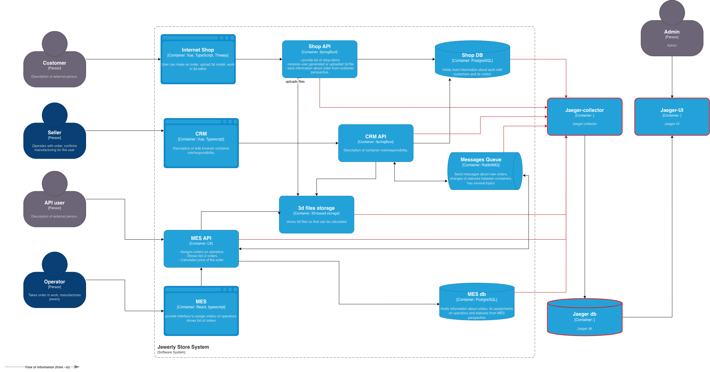
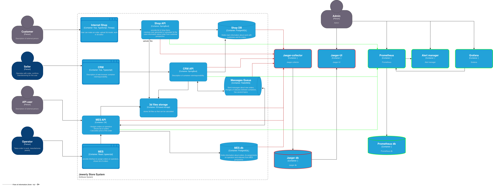

## Архитектурное решение по трейсингу

### Системы, которые следует покрыть трейсингом

**Сервисы**

* Shop API
* CRM API
* MES API

**Интеграции**

* Messages Queue. Взаимодействие между компонентами через RabbitMQ

**Хранилища**

* 3d files storage. Сохранение 3D-файлов и других данных.
* Shop DB. Хранение информации о заказах.
* MES db. Хранение информации о производственных процессах.

### Мотивация
Основная цель внедрения трейсинга (отслеживания) — получить полную, 
непрерывную и достоверную картину работы системы или бизнес-процесса.

Это позволяет:

* Диагностировать проблемы — быстро находить коренные причины сбоев, ошибок и узких мест.
* Анализировать производительность — измерять время выполнения операций, выявлять «медленные» компоненты и оптимизировать их.
* Обеспечить наблюдаемость (Observability) — понимать, что происходит внутри системы в реальном времени, а не только видеть факт её работы или падения.
* Упростить отладку в распределённых системах — отслеживать запрос, который проходит через множество микросервисов, что критично для современных облачных приложений.
* Улучшать качество обслуживания — на основе данных трейсинга принимать обоснованные решения по развитию инфраструктуры и архитектуры.

### Предлагаемое решение

Для трейсинга предлагает использовать Jaeger.

Jaeger (Йегер) — это платформа распределенной трассировки с открытым исходным кодом, 
используемая для мониторинга, отладки и оптимизации производительности сложных микросервисных архитектур.

Основные компоненты Jaeger:

* Jaeger Client: Инструментирование (код) приложения для создания трасс.
* Agent: Сетевой демон, собирающий данные от клиентов (обычно локально).
* Collector: Получает трейсы от агентов и обрабатывает их.
* Storage: База данных (например, Cassandra или Elasticsearch) для хранения трейсов.
* Query & UI: Сервис и веб-интерфейс для поиска, анализа и визуализации трасс. 

Для внедрения трейсинга нужно выполнить стедующие задачи:

* Добавить настройки, добавить код в: Shop API, CRM API, MES API.
* Добавить настройки в: Messages Queue, в хранилища. 
* Развернуть Jaeger.
* Настроить взаимодействие между клиентами и коллектором Jaeger.
* Настроить доступ к Jaeger UI.

[jewerly_c4_model_t.drawio](jewerly_c4_model_t.drawio)

### Компромиссы

**Когда трейсинг не принесёт пользы.**

* Внедрение в унаследованные или закрытые системы. Если вы не можете изменить исходный код компонента (проприетарное ПО, устройство "чёрный ящик").
* Внедрение в сторонние SaaS-сервисы и внешние API. Вы не можете инструментировать в сторонний. Вы можете лишь создать span на момент входа и выхода вашего вызова, но не увидите внутренностей внешнего сервиса.
* Внедрение в некоторые протоколы и очереди сообщений. Инструментирование может быть сложным или неподдерживаемым для специфических протоколов (например, gRPC-streaming, WebSockets, UDP-протоколы) или брокеров сообщений.

### Безопасность

* Доступ к данным трейсинга будет ограничен по ролям для учётных записей.
* Весь трафик будет зашифрован для обеспечения безопасности обмена данными между сервисами.
* В случае необходимости, все чувствительные данные, такие как персональная информация, будут исключены из трейсинга.

### Автоматический мониторинг процесса прохождения заказа

#### Что будет отслеживаться

* Заказы, которые не меняют статус в рамках SLA.
* Время, затраченное на расчёт цены заказа.
* Задержки и ошибки в обработке сообщений и обработке запросов.

#### Как будет работать

* Необходимо развернуть Prometheus, Grafana и систему алертинга
* Настроить и модифицировать код на стороне сервисов для отправки данных в мониторинг
* Настроить метрики, алерты, дашборды
* Настроить доступ к Prometheus, Grafana, системе алертинга

[jewerly_c4_model_m.drawio](jewerly_c4_model_m.drawio)
