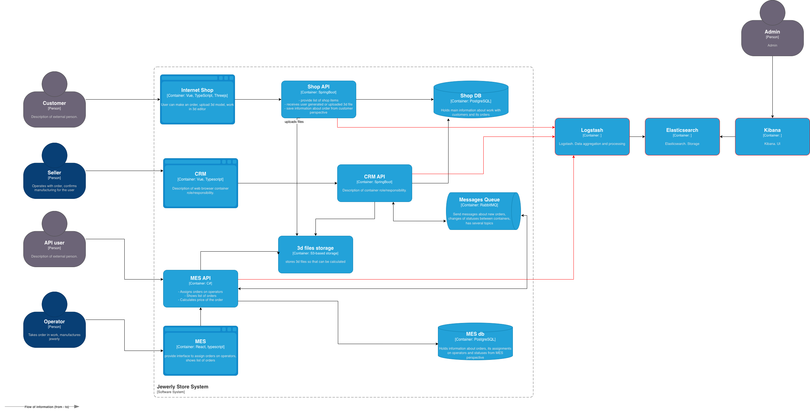

## Архитектурное решение по логированию

### Какие логи нужно собирать

**INFO**

* Создание нового заказа. Время, ID заказа, ID пользователя.
* Изменение статуса заказа. Время, ID заказа, ID пользователя, статус.
* Запуск расчёта стоимости заказа. Время, ID заказа.
* Завершение расчёта стоимости заказа. Время, ID заказа, стоимость.
* Запросы и сообщения RabbitMQ. Время, ID заказа, название операции, исходная и целевая системы.

**ERROR**

* Ошибки и задержки в выполнении операций API и БД. Время, ID заказа, название операции, система и ошибка.
* Ошибки и задержки в запросах RabbitMQ. Время, ID заказа, название операции, система и ошибка.

### Мотивация

#### Почему в систему нужно добавить логирование

**Диагностика и отладка**

Логирование позволяет отслеживать выполнение программы, выявлять ошибки и аномалии в работе системы, 
что ускоряет поиск и устранение сбоев.

**Мониторинг производительности**

С помощью анализа логов можно оценивать скорость выполнения операций,
находить «узкие места» в системе и оптимизировать её работу.

**Аудит и безопасность**

Логи фиксируют действия пользователей и системные события, что помогает расследовать инциденты, 
контролировать доступ и соблюдать требования регуляторов.

**Анализ поведения пользователей**

Запись событий позволяет изучать, как пользователи взаимодействуют с приложением, 
и использовать эти данные для улучшения функциональности.

**Восстановление после сбоев**

При аварийных ситуациях логи помогают восстановить цепочку событий, ведущих к ошибке, 
и минимизировать потери данных или времени на восстановление работы системы.

#### Технические и бизнес-метрики решения

**Технические метрики**

* Mean Time To Recovery (MTTR) — Среднее время восстановления. Время от момента обнаружения сбоя до его полного устранения.
* Процент ошибок (Error Rate). Доля неудачных запросов (например, с HTTP-статусами 5xx и 4xx) от общего числа запросов.
* Latency / Время отклика (P50, P95, P99). Время выполнения операций, особенно важно отслеживать перцентили (P95, P99), которые показывают опыт самых "невезучих" пользователей.

**Бизнес-метрики**

* Доход / Конверсия (Revenue / Conversion Rate). Ключевой финансовый показатель и процент пользователей, совершающих целевое действие (создание заказа).
* Операционные расходы (OpEx — Operational Expenditure). Затраты на поддержку и эксплуатацию IT-систем, включая зарплаты инженеров и затраты на инфраструктуру.

#### Для каких систем нужно настраивать логирование и трейсинг в первую очередь 

**Shop API**

Основная часть системы. Здесь происходит работа с основной сущностью системы - заказ.

**MES API**

Главная часть системы для расчета стоимости.

### Предлагаемое решение

#### Стек для логирования

Для сбора, обработки и анализа логов предлагается использовать следующий стек на базе ELK:

**Сбор логов**

Каждый контейнер должен отправлять логи в logstash, или самостоятельно или с помощью агентов.

**Обработка**

Logstash может быть использован для парсинга логов, обогащения информацией о сервисе и окружении.

**Хранилище**

Elasticsearch для хранения логов и проведения поисковых запросов.

**Визуализация**

Kibana для визуализации логов, создания дашбордов и настройки алертов.

[jewerly_c4_model_l.drawio](jewerly_c4_model_l.drawio)

#### Политика безопасности

Для обеспечения безопасности в логах рекомендуется:

* Разграничение доступа к логам в зависимости от роли учетной записи пользователя.
* Маскировка и шифрование данных при передаче.
* Обеспечить защищённый доступ для просмотра логов.

#### Политика хранения

* Логи создаются в отдельных индексах каждый день.
* Хранение логов осуществляется в течение 4 недель, после чего данные перемещаются в архив.

### Мероприятия для превращения системы сбора логов в систему анализа логов

ELK стек позволяет настроить алертинг. В алертинг может войти: превышение кол-во заказов в очередях по статусам, 
кол-во ошибок в системе по сервисам.

С помощью ELK стека можно искать аномалии. К примеру, обработка одного и того же статуса заказа многократно.  

### Критерии для выбора технологии для работы с логами

| № | Критерий                             | ELK                                  | OpenSearch                                      | Splunk                                                                          | _ |
|---|--------------------------------------|--------------------------------------|-------------------------------------------------|---------------------------------------------------------------------------------|---|
| 1 | Лицензия                             | Elastic License.                     | Apache License, Version 2.0.                    | Проприетарная.                                                                  | _ | 
| 2 | Производительность и масштабирование | Хорошо масштабируется горизонтально. | Аналогичная масштабируемость c ELK.             | Вертикальное масштабирование проще, но дороже; горизонтальное — через кластеры. | _ | 
| 3 | UI и простота использования          | Мощный, гибкий, но требует обучения. | Практически идентична Kibana.                   | Более интуитивный и polished интерфейс, меньше порог входа.                     | _ | 
| 4 | Экосистема и интеграции              | Огромное кол-во готовых интеграций.  | Сопоставимо с ELK.                              | Множество готовых плагинов (Apps & Add-ons), поддержка производителей.          | _ | 
| 5 | Безопасность и администрирование     | Безопасность — в платной лицензии.   | Встроенная безопасность (SSL, RBAC) бесплатно.  | Готовая корпоративная безопасность «из коробки».                                | _ | 
| _ | _                                    | _                                    | _                                               | _                                                                               | _ | 
