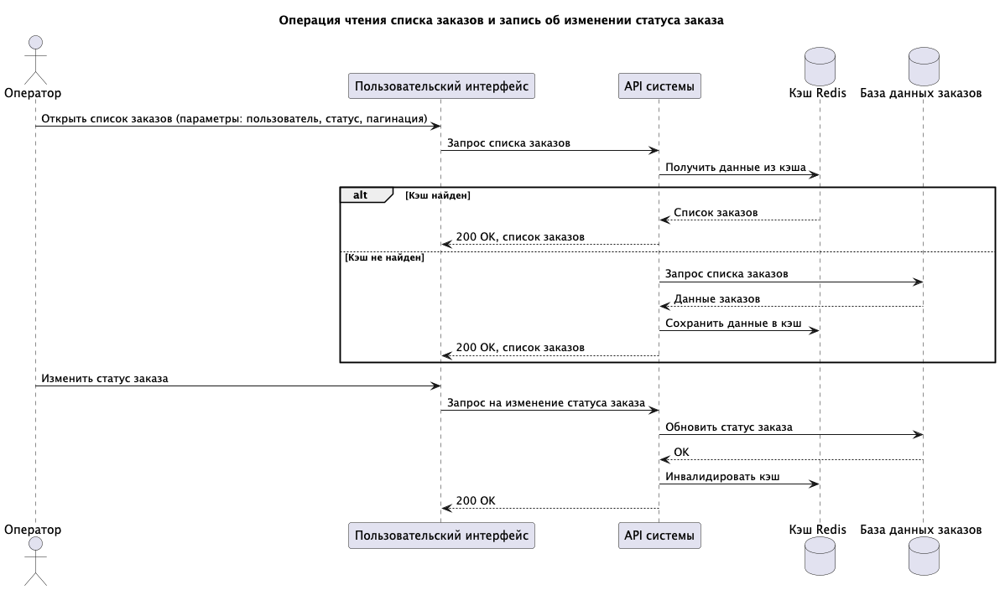

## Архитектурное решение по кешированию

### Мотивация

Одна из проблем - это долгая загрузка первой страницы MES с заказами и статусами.

Для решения этой проблемы предлагается создать кеш для востребованных заказов со статусами и деталями для дашбордов.

Это позволит формировать данные для первой страницы в обход БД, что должно значительно ускорить загрузку страницы.

### Предлагаемое решение

Предлагается внедрить кэширование на сервере с использованием Redis.

* Это позволит иметь общий кеш для все пользователей, что снизит затраты на ресурсы.
* Redis предлагает не просто key-value, а оптимизированные структуры, что позволит хранить детали заказов.
* Для хранения можно установить TTL, что позволит контролировать свежесть данных.

#### Какой паттерн будет применяться

В данном случае можно воспользоваться паттерном Cache-Aside.

Cache-Aside (Lazy Loading) — паттерн кеширования, при котором кеш загружается "по требованию", а не заранее.

**Получение данных**

* Приложение сначала проверяет кеш (например, Redis)
* Если есть (Cache Hit) → возвращаются данные из кеша
* Если нет (Cache Miss) → данные берутся из основного хранилища (БД)

**Обновление кеша**

* После получения данных из БД, они сохраняются в кеш для последующих запросов

**Запись данных**

* Данные сначала пишутся в основное хранилище (БД)
* Затем инвалидируется (удаляется) соответствующий ключ в кеше
* При следующем чтении произойдёт Cache Miss и кеш обновится актуальными данными

**Преимущества Cache-Aside:** 

* высокая частота чтения; 
* простота внедрения;
* гибкость в инвалидации данных; 
* минимальные накладные расходы.

**Основные недостатки паттерна Write-Through кеширования:**

* Высокая задержка записи (Write Latency)
* Риск "холодного" кеша после сбоя
* Сложность обработки ошибок

**Основные недостатки паттерна Refresh-Ahead:**

* Избыточное потребление ресурсов. Трудно определить оптимальное время для предзагрузки.
* Проблема "over-refresh". Частые обновления данных, которые редко читаются
* Увеличение сложности системы.

### Операция чтения списка заказов и запись об изменении статуса заказа

[cache_seq.puml](cache_seq.puml)

### Стратегии инвалидации кеша

| № | Стратегия                                  | Описание                                                                  | Преимущества                                                                                         | Недостатки                                                                                                                         | Когда использовать                                                                      |
|---|--------------------------------------------|---------------------------------------------------------------------------|------------------------------------------------------------------------------------------------------|------------------------------------------------------------------------------------------------------------------------------------|-----------------------------------------------------------------------------------------|
| 1 | TTL (Time To Live)                         | Ключ автоматически удаляется после фиксированного времени                 | 1) Простота реализации 2) Автоматическая очистка 3) Предсказуемость                                  | 1) Возможна устаревшая информация 2) Cache Miss, даже если данные не менялись 3) Сложно подобрать идеальное TTL                    | Статические или редко меняющиеся данные (справочники, контент CMS, настройки)           | 
| 2 | Явная инвалидация (Explicit Invalidation)  | Кэш удаляется/обновляется приложением после изменения данных в источнике  | 1) Максимальная консистентность 2) Эффективное использование памяти 3) Нет задержек на ожидание TTL  | 1) Высокая связность 2) Сложность управления в распределенных системах 3) Риск ошибок (забыли инвалидировать → устаревшие данные)  | Критичные к актуальности данные (баланс счета, статус заказа, цена в реальном времени)  | 
| _ | _                                          | _                                                                         | _                                                                                                    | _                                                                                                                                  | _                                                                                       | 

